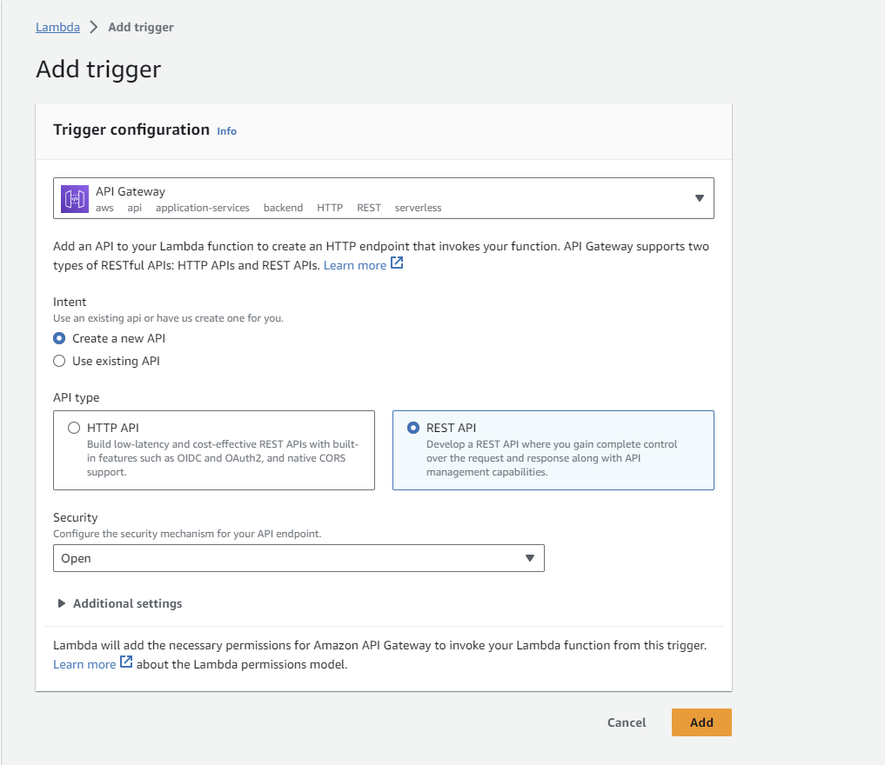
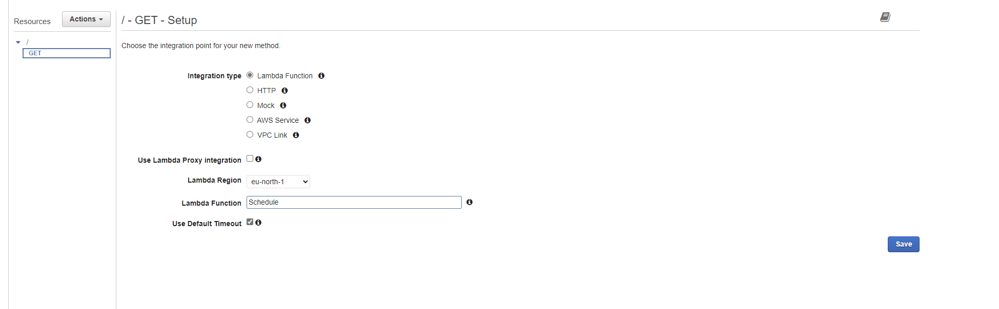
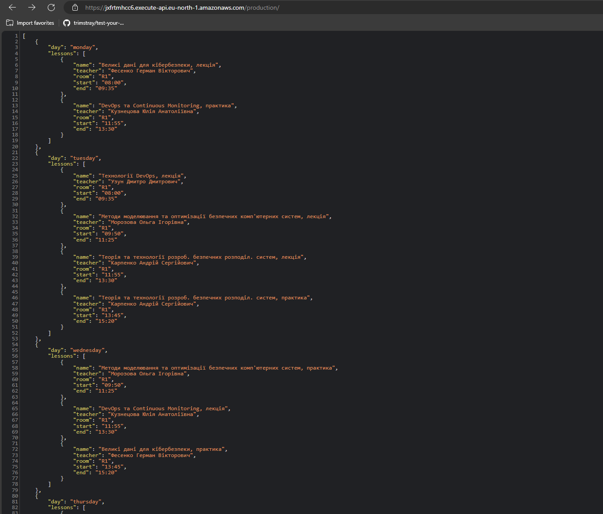

# lab 3

## Resources
https://lab3.khai.1node.xyz/
https://lab3.khai.1node.xyz/lessons/{day}

## Description
1. Create lambda function
2. Build code and create zip archive
3. Upload zip archive to lambda function
4. Update runtime settings (Handler name)
5. Test lambda function
6. Create API Gateway
7. Remove default method
8. Setup GET method for /
9. Create parameter based resource and GET method for it
10. Create production stage
11. Deploy API
12. Test /
13. Test /{day}
14. Add custom domain name and ssl certificate
15. Test custom domain name

