# lab2
1. Створив security групу.
2. Додав свій SSH ключ.
3. Створив windows інстанс. Спробував з user data, але скрипт не спрацював. Не став розбиратись, доробив мануально.
4. Створив linux інстанс. Я використовував Ubuntu 22.04. Скрипт в прикладі під red-had-based системи, тому наконфігурував мануально.
5. Мануально підкинув файли. Для linux пофіксив права та овнера. Сконфігурував nginx.
6. Пофіксив помилки у вінді. Дякую майкрософтам за інформативні логи (ні).
7. Термінейтнув інстанси.

## Графічні матеріали згідно пунктів

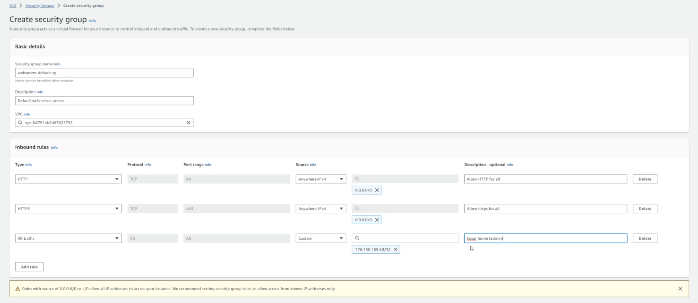
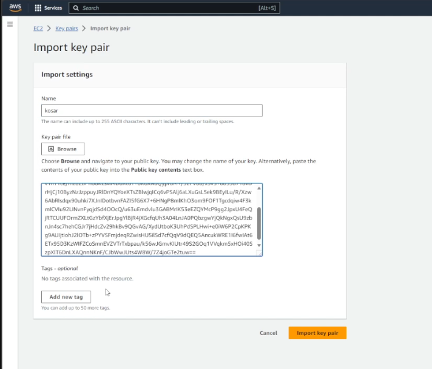

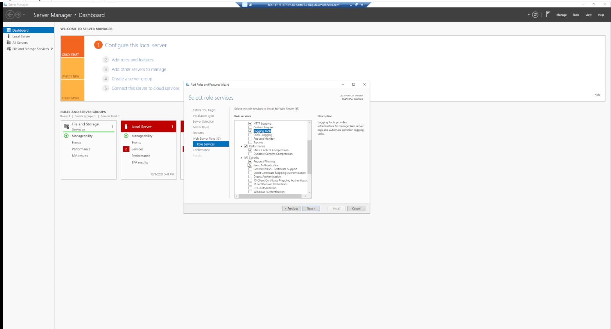
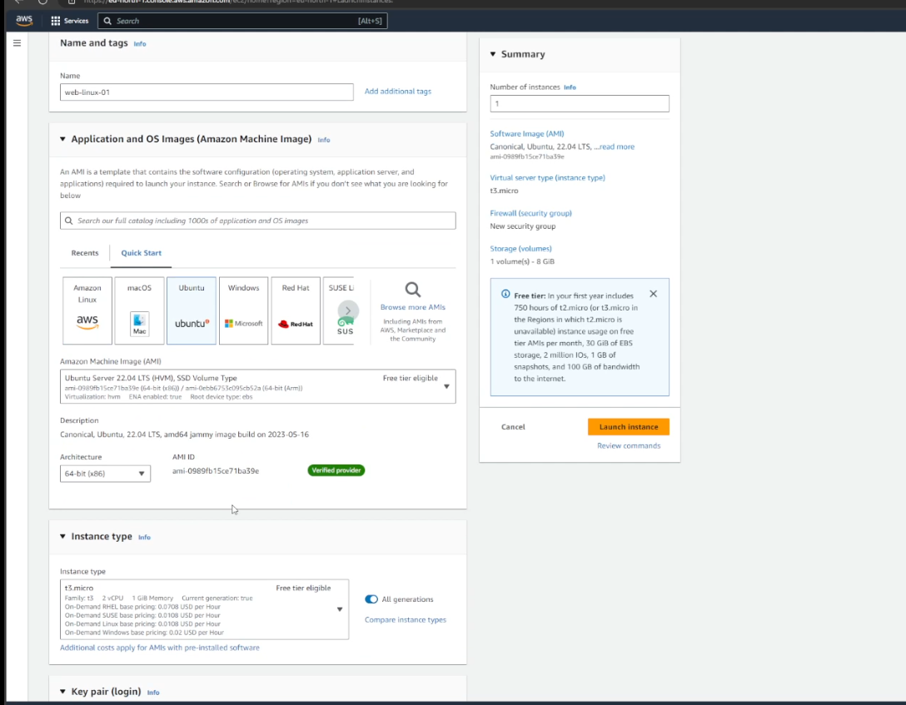
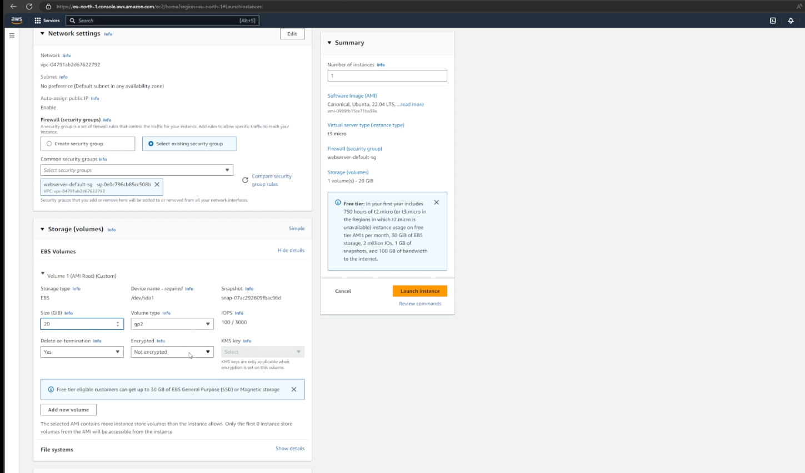

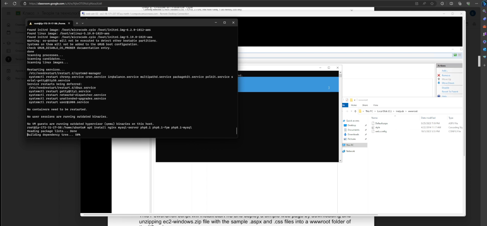
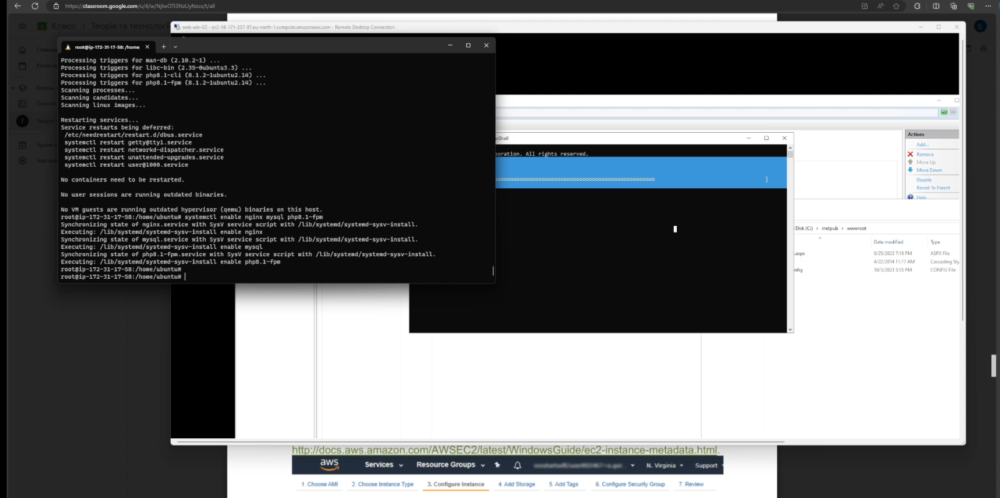
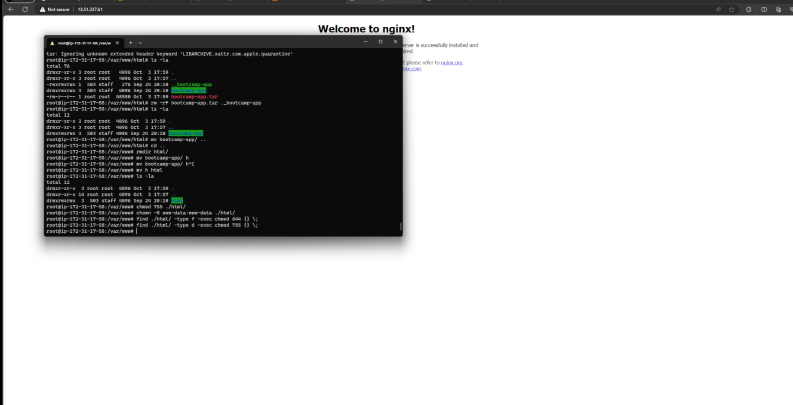

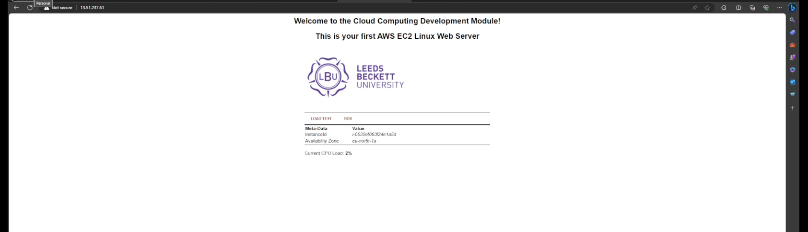
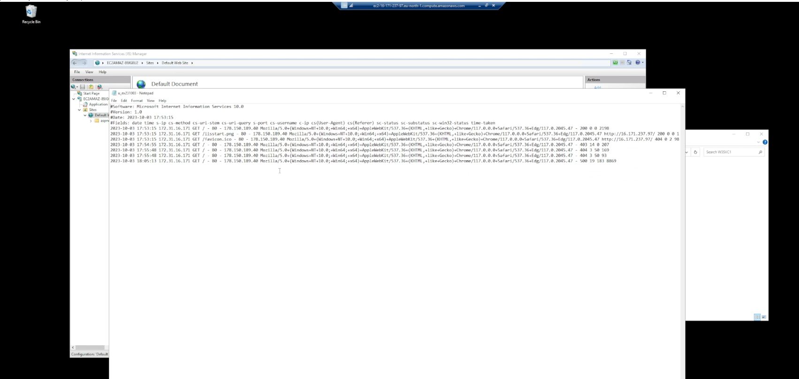

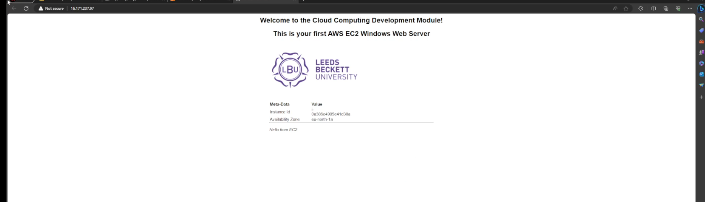
