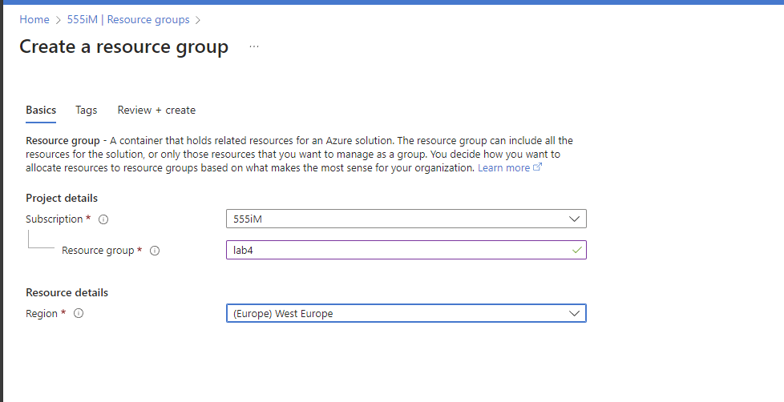
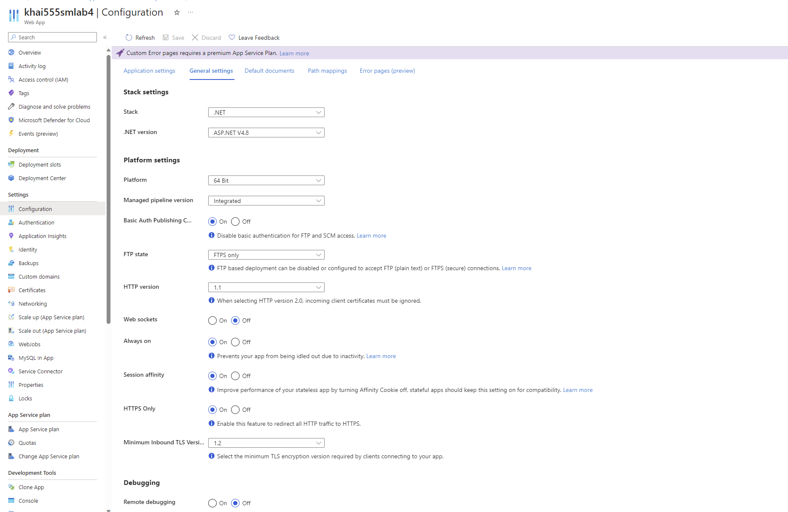
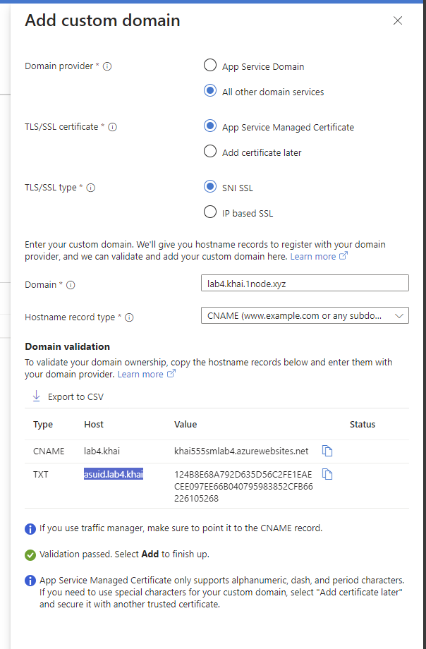
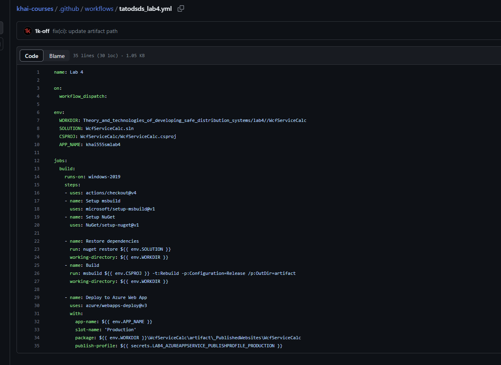
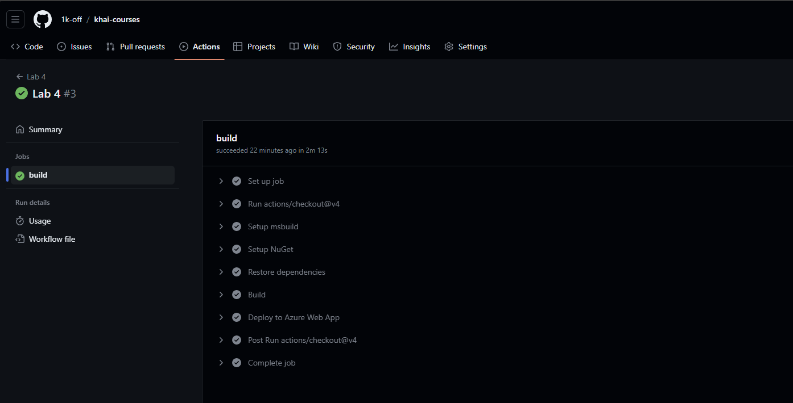
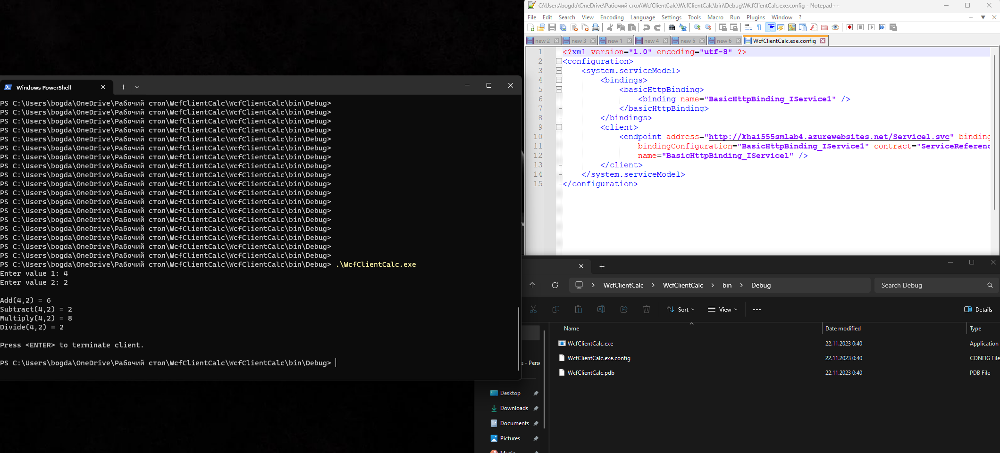
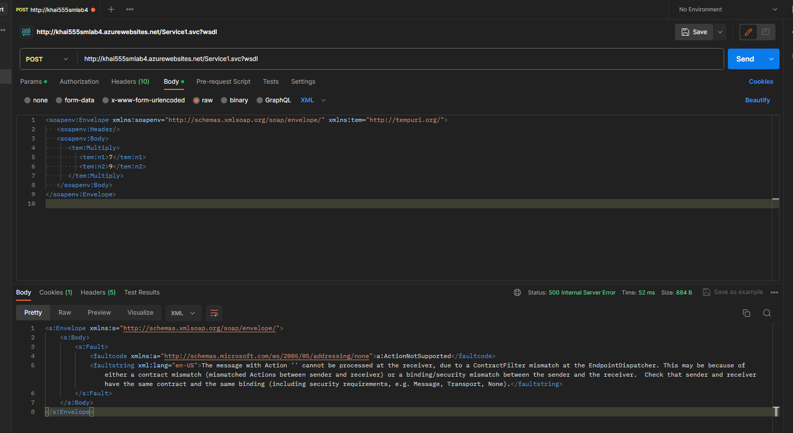

# lab 4
## Note
I don't have Visual Studio installed and don't have an ability to install it, so I used GitHub actions to build the code and skipped the local testing.

Project code is TOO OLD. Please update it to dotnet 6/7/8. Or, use go :) it can be compiled everywhere to a single binary and run everywhere without any dependencies.

## Description

1. I already have registered Azure account so I'll use it.
2. Create resource group.
3. Create web app.
4. Setup web app.
5. Add code to repo.
6. Setup pipeline.
7. Deploy.
8. Run client and test.
9. Test SOAP

I tried to send SOAP req with Postman, but got an error (see text and req body below). Probably I created wrong body, idk.

``` 
<s:Envelope xmlns:s="http://schemas.xmlsoap.org/soap/envelope/">
    <s:Body>
        <s:Fault>
            <faultcode xmlns:a="http://schemas.microsoft.com/ws/2005/05/addressing/none">a:ActionNotSupported</faultcode>
            <faultstring xml:lang="en-US">The message with Action '' cannot be processed at the receiver, due to a ContractFilter mismatch at the EndpointDispatcher. This may be because of either a contract mismatch (mismatched Actions between sender and receiver) or a binding/security mismatch between the sender and the receiver.  Check that sender and receiver have the same contract and the same binding (including security requirements, e.g. Message, Transport, None).</faultstring>
        </s:Fault>
    </s:Body>
</s:Envelope>
```

```xml
<soapenv:Envelope xmlns:soapenv="http://schemas.xmlsoap.org/soap/envelope/" xmlns:tem="http://tempuri.org/">
   <soapenv:Header/>
   <soapenv:Body>
      <tem:Multiply>
         <tem:n1>7</tem:n1>
         <tem:n2>9</tem:n2>
      </tem:Multiply>
   </soapenv:Body>
</soapenv:Envelope>

```



I upgraded ASP to B1 to have ability to use custom domain name and use some web app settings.
(Enable 64 bit, enable aways on, add custom domain and app service certificate)


Then I disabled https only because code does not support https. In 2023. Srsly?



