# lab 5
## Note
I don't have Visual Studio installed and don't have an ability to install it, so I used GitHub actions to build the code and skipped the local testing.

1. I already have registered AWS account so I'll use it.
2. Created IAM user with programmatic access and admin permissions.
3. Created Elastic beanstalk application.
4. Setup GitHub actions to deploy code to Elastic beanstalk.
5. Deploy code.
6. Check URL.
7. Run client and test.

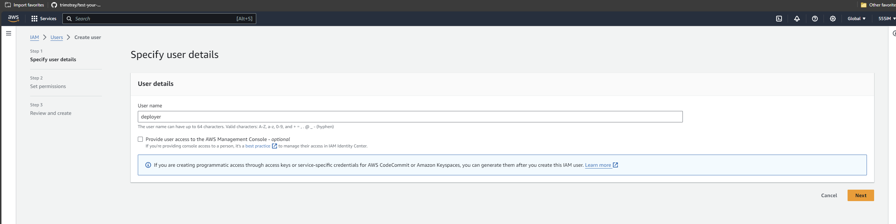
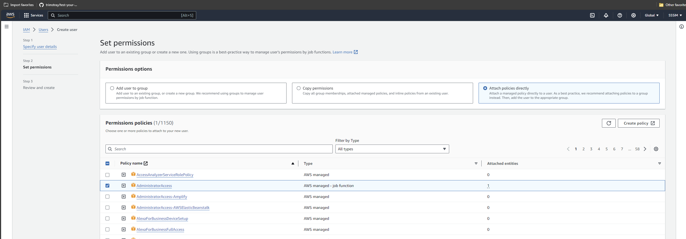
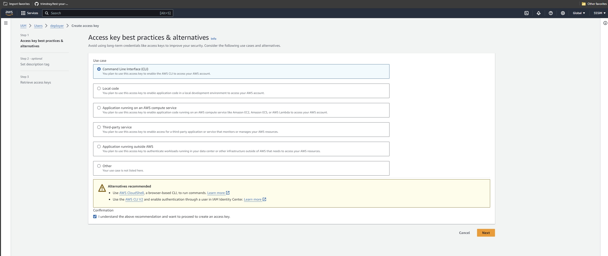
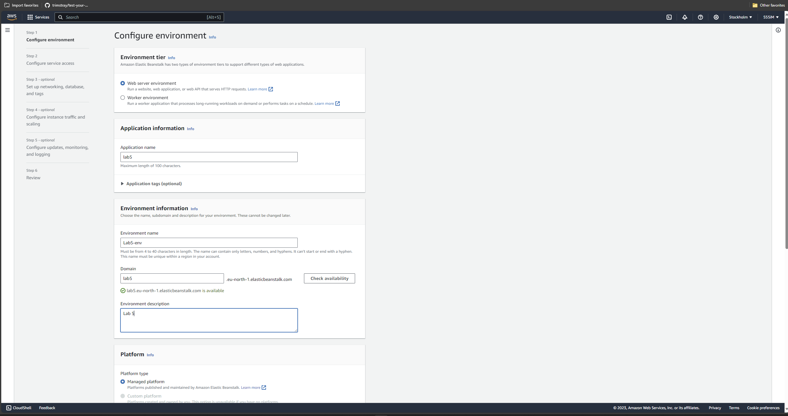
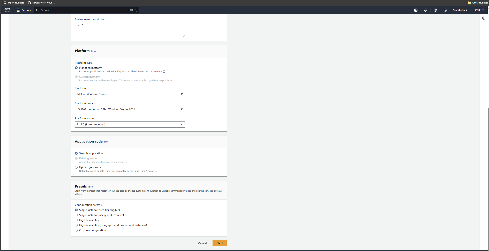
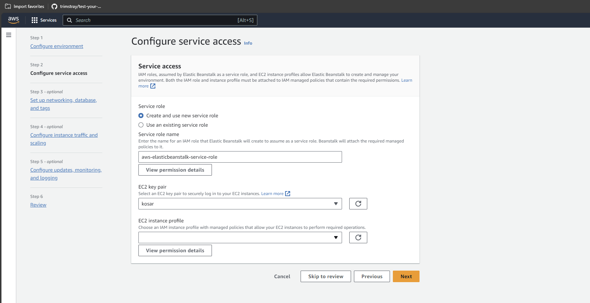
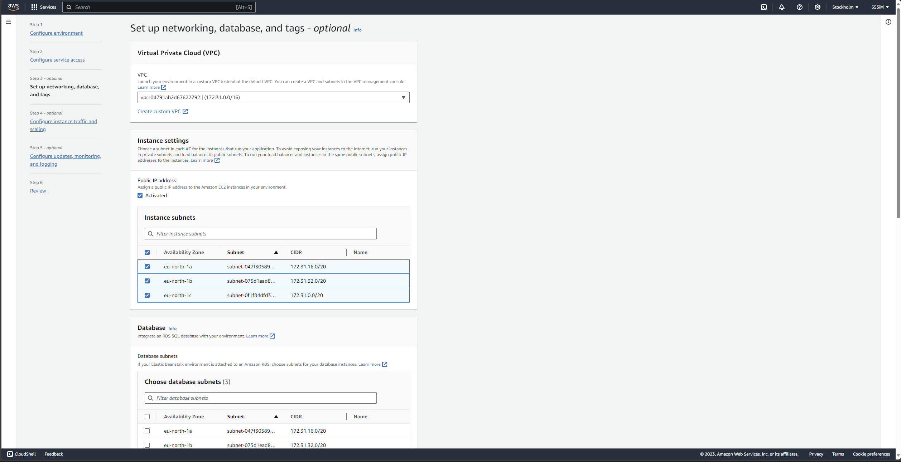

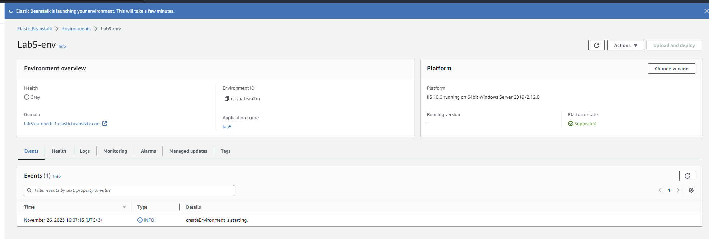
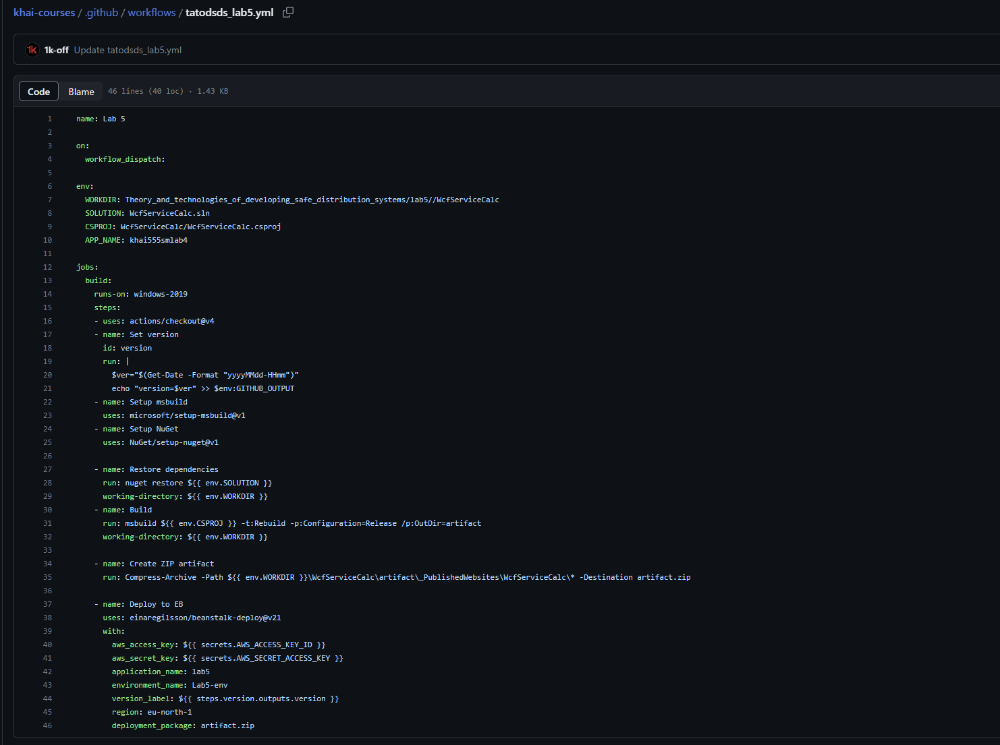

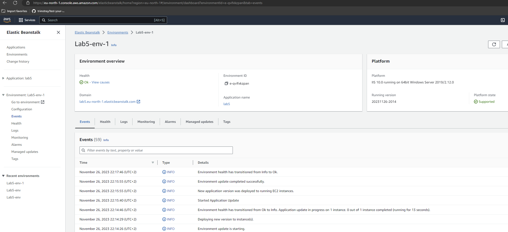
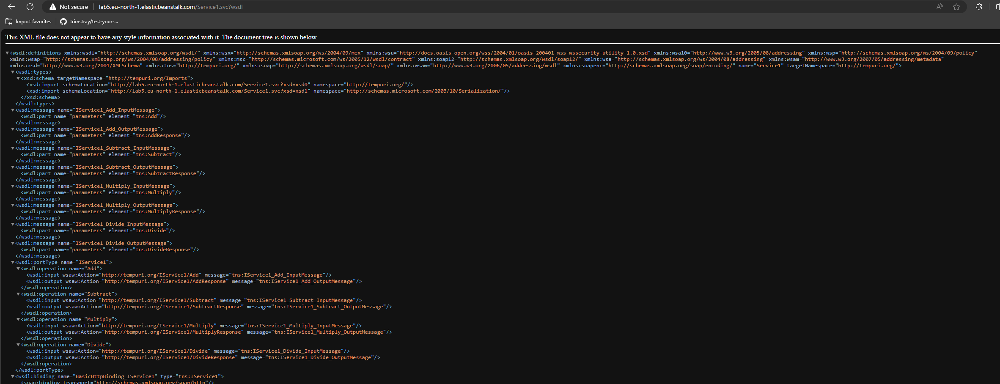
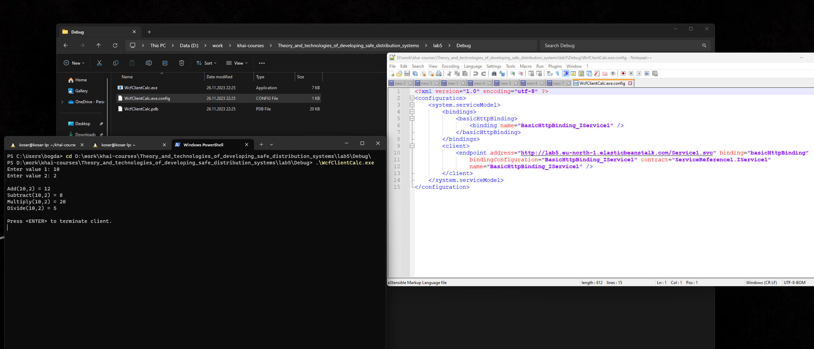